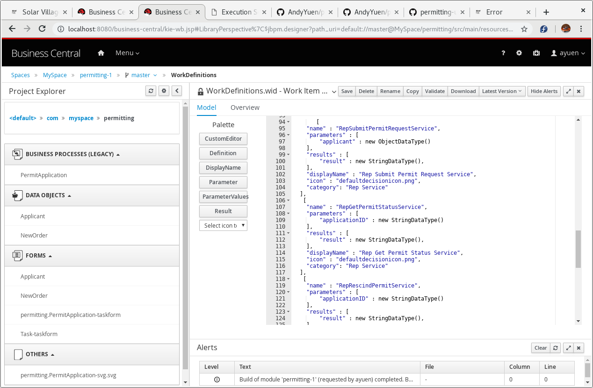
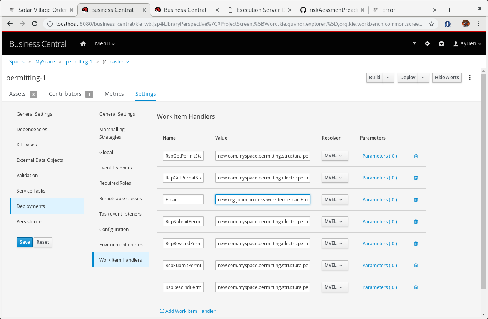
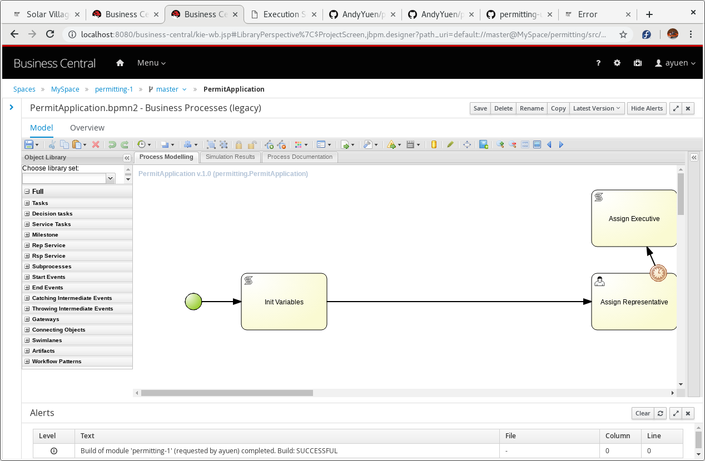

# 1. permitting-services
This provides the mock government services for the order permitting business process in the link below:

```
https://github.com/AndyYuen/permitting
```

# 2. Build the services (WorkItemHandlers)


1. Create a folder for the git repository
  ```
  $ mkdir ~/github
  $ cd ~/github
  ```
2. Execute the git clone command:

  ```
  $ git clone https://github.com/AndyYuen/permitting-services.git
  ```
3. Build the services by executing 
  ```
  $ cd ~/github/permitting-services
  $ mvn clean install
  ```

## 3. Configuring the services

The services have already been configured when the permitting business process project was imported via Business Central. Here are the configuration for the services:

Work Item Definitions


Work Item Handler Configuration


New Items in the Object Library - New "Rep Service" and "Rsp Service" on the left-hand-side library set



